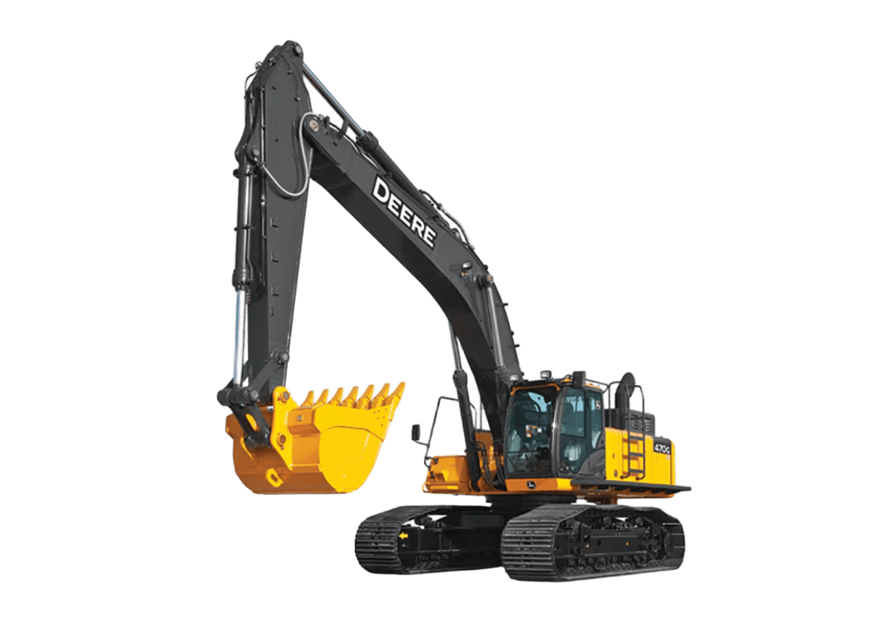
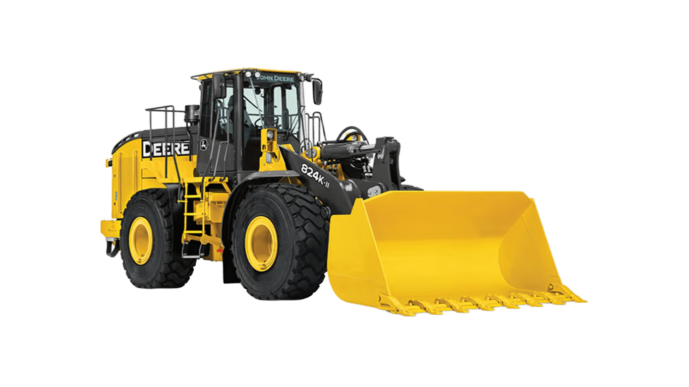
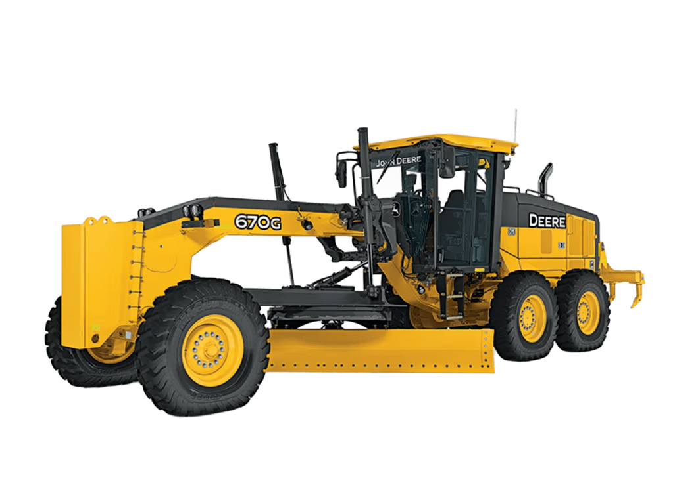
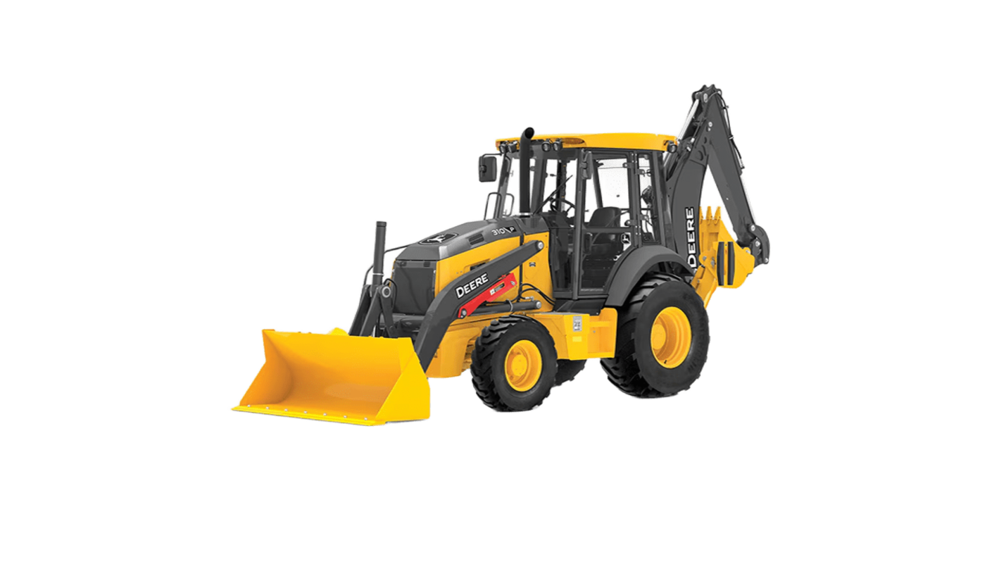
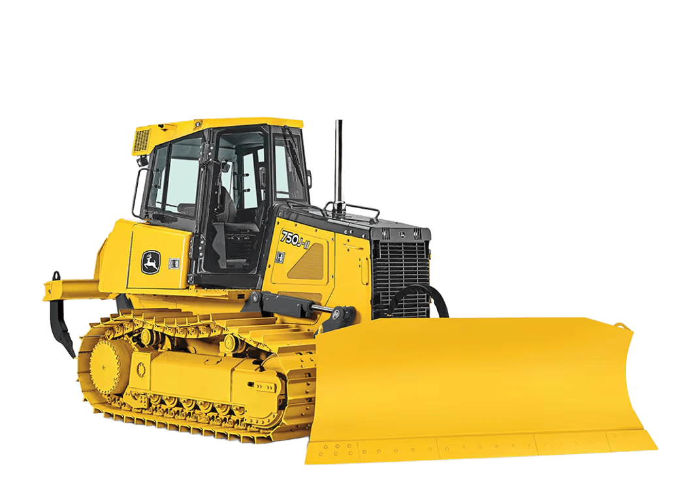

# 📜 Certificados John Deere – Linha Amarela

Bem-vindo(a) ao meu repositório de **certificados John Deere** na área de **linha amarela** 🚜⚙️  
Aqui você encontra a comprovação das minhas qualificações, treinamentos e cursos realizados na plataforma oficial da John Deere, voltados para **operação**, **manutenção** e **tecnologia aplicada** em máquinas pesadas.

  
  

---

## 🗂 Estrutura do Repositório
📁 **/certificados** → PDFs e imagens digitalizadas dos certificados.  
📄 **README.md** → Este documento explicativo.

---

## 🎯 Objetivo
Centralizar e organizar meus certificados para:
- ✅ Facilitar a comprovação das minhas competências técnicas.  
- 📂 Manter um portfólio atualizado das formações concluídas.  
- 🔍 Disponibilizar para recrutadores, parceiros e clientes.

---

## 🏗 Linha Amarela – O que é?
A **linha amarela** da John Deere abrange máquinas de construção, movimentação de terra e equipamentos pesados como:
 **Escavadeiras**  
 **Pás-carregadeiras**  
 **Motoniveladoras**  
 **Retroescavadeiras**  
 **Tratores de Esteiras**

---

## 📌 Exemplos de cursos concluídos
- 🔹 Manutenção preventiva e corretiva em escavadeiras.  
- 🔹 Sistemas hidráulicos e elétricos em máquinas de construção.  
- 🔹 Diagnóstico de falhas via Service ADVISOR™.  
- 🔹 Tecnologia de monitoramento e telemetria JDLink™.

---

## 📞 Contato
- **LinkedIn:** [Renato Ribeiro](https://www.linkedin.com/in/renato-ribeiro2022/)  
- **E-mail:** [renato_mry@hotmail.com](mailto:renato_mry@hotmail.com)  
- **GitHub:** [Renato-Ribeiroo](https://github.com/Renato-Ribeiroo)  

---

> 💡 *Todos os certificados aqui publicados são de minha autoria e obtidos por meio de treinamentos oficiais John Deere.*
